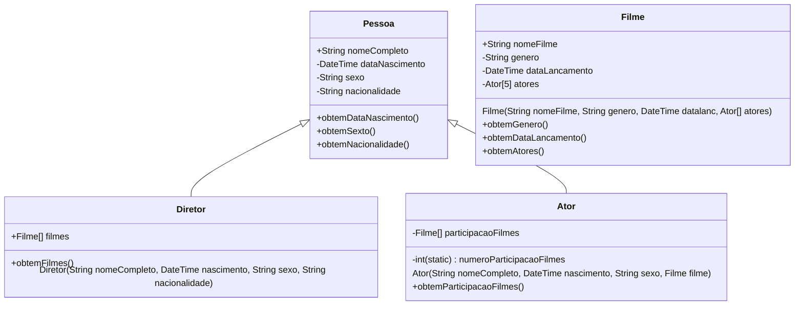

## PROJETO FINAL - CATÁLOGO DE FILMES - IMDb

## Disciplina: Programação Orientada a Objetos I - Curso: Ser + Tech Programa 50+ (Turma #1076)
### Professor: Rodolfo Ferreira de Lima
### Grupo 03 
- **Deyse Ribeiro** 
- **Dirce Mitiko Taira**
- **Gerson Camillo**
- **Teofilo Nicolau**

### DESCRIÇÃO DO PROJETO:
Este projeto tem como objetivo principal desenvolver um sistema que apresente um catálogo de filmes, similar ao Internet Movie Database (IMDb).

Cada um dos filmes catalogados, deverá possuir alguns atributos, tais como: nome, data de lançamento, orçamento e descrição.

Assim como também, apresentar um diretor, uma lista de atores que trabalharam no filme. 
E adicionar atributos para as pessoas. 

 
 
Implementar uma aplicação em que o usuário possa:

-> cadastrar filmes;

-> cadastrar atores;

-> associar um filme com seus atores e diretores;

-> permitir pesquisar filmes cadastrados pelo nome, desconsiderando letras maiúsculas e minúsculas.

 
 
**OBSERVAÇÕES**:

 - É necessário que se utilize os conceitos de programação orientada a objetos vistos nas aulas: como encapsulamento, herança, polimorfismos e classes abstratas.
 - O projeto será desenvolvido em grupos de até 4 integrantes
 - A entrega será feita via repositório GIT. 
 - A avaliação será feita considerando os commits individuais, portanto é importante que todos colaborem no desenvolvimento do projeto.

## Diagrama de classes básico do projeto
Uma prévia das classes.

