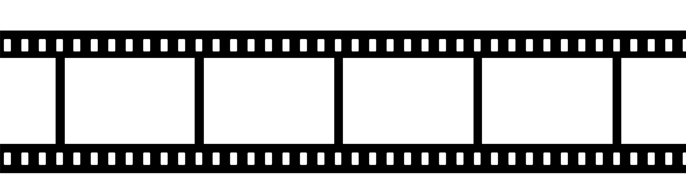

## PROJETO FINAL - CATÁLOGO DE FILMES - IMDb


## Disciplina: Programação Orientada a Objetos I - Curso: Ser + Tech Programa 50+ (Turma #1076)
### Professor: Rodolfo Ferreira de Lima
### Grupo 03
- **Deyse Ribeiro**
- **Dirce Mitiko Taira**
- **Gerson Camillo**
- **Teofilo Nicolau**


### DESCRIÇÃO DO PROJETO:
Este projeto visa desenvolver um sistema que apresente um catálogo de filmes, similar ao Internet Movie Database (IMDb).


Cada um dos filmes catalogados deverá possuir alguns atributos, tais como: nome, data de lançamento, orçamento e descrição.

Assim como também, apresentar um diretor, uma lista de atores que trabalharam no filme.
E adicionar atributos para as pessoas.

Implementar uma aplicação em que o usuário possa:

- cadastrar filmes
- cadastrar atores
- associar um filme com atores e um diretor
- permitir pesquisar filmes cadastrados pelo nome, desconsiderando letras maiúsculas e minúsculas.

**OBSERVAÇÕES**:

- É necessário que se utilize os conceitos de programação orientada a objetos vistos nas aulas: como encapsulamento, herança, polimorfismos e classes abstratas.
- O projeto será desenvolvido em grupos de até 4 integrantes
- A entrega será feita via repositório GIT.
- A avaliação será feita considerando os commits individuais, portanto é importante que todos colaborem no desenvolvimento do projeto.


## Diagrama de classes básico do projeto


### Estrutura de Dados
Cada classe (Ator, Diretor e Filme) será representada por um ArrayList de objetos criados dentro da classe *controller* IMDB. Então, tamanho será dinâmico.

O armazenamento de `nome de ator`, `nome de diretor` e `nome de filme` será conforme entrada do usuário, ou seja, o case da entrada será armazenado nas estruturas de dados. A **pesquisa** será sempre por ***letras minúsculas***.

### Considerações sobre alguns métodos

As classes `Ator`, `Diretor` e `Filme` sobrescreverão o método `toString` para apresentar dados básicos dos objetos Ator, Diretor e Filme.

```mermaid
classDiagram
    Pessoa <|-- Diretor
    Pessoa <|-- Ator
    Pessoa : +String nomeCompleto
    Pessoa : -DateTime dataNascimento
    Pessoa : -String sexo
    Pessoa : -String nacionalidade
    Pessoa: +obtemDataNascimento()
    Pessoa: +obtemSexto()
    Pessoa: +obtemNacionalidade()
    class Diretor{
      +String nomeDiretor
      +String toString()
      +String getNomeDiretor()
      +Diretor(String nomeDiretor)
    }
    class Ator{
      -int (static) numeroParticipacaoFilmes
      -Filme[] participacaoFilmes
      Ator(String nomeCompleto, DateTime nascimento, String sexo, Filme filme)
      +obtemParticipacaoFilmes()
    }
    class Filme{
      +String nomeFilme
      -String genero
      -DateTime dataLancamento
      -ArrayList<Ator> elenco
      -Diretor diretor
      Filme(String nomeFilme, String genero, DateTime datalanc,
            Diretor diretor,
            ArrayList<Ator>)
      +obtemGenero()
      +obtemDataLancamento()
      +obtemAtores()
    }
    class IMDB{
      +ArrayList<Ator> listaAtores
      +ArrayList<Diretor> listaDiretores
      +ArrayList<Filme> listaFilmes
      -String[] tiposGeneros
      +main(String[] args)
      +processarEntrada()
      +processarEntradaAtor()
      -Ator incluirAtor(String nomeAtor)
      +processarEntradaDiretor()
      -Diretor incluirDiretor(String nomeDiretor)
      +processarEntradaFilme()
      -Filme incluirFilme(String nomeFilme)
      +Ator pesquisarAtor(String nomeAtor)
      +Diretor pesquisarDiretor(String nomeDiretor)
      +Filme pesquisarFilme(String nomeFilme)
    }
```

# Alguns comandos básicos em GIT para este projeto

Este projeto demanda trabalho colaborativo e a ferramenta usada foi o GIT através do diretório de projetos do GitHub. Então, foi criado um projeto inicial na conta glcamillo ([https://github.com/glcamillo](https://github.com/glcamillo) no GitHub e foram incluídos os seguintes colaaboradores:
1. Deyse Ribeiro
2. Dirce Mitiko Taira
3. Teofilo Nicolau

Num primeiro momento, o projeto deve ser trazido para a máquina pessoal de cada participante via:
`git clone https://github.com/glcamillo/poo-projeto-catalogo-imdb.git`

a) Antes de iniciar qualquer alteração/inclusão de código, atualizar o repositório LOCAL com o comando a seguir:

`git pull`

Observações:
- Comandos considerando que o projeto já tenha sido clonado para a máquina local;
- Todos os comandos devem ser executados no diretório do projeto. Ao abrir no IntelliJ, ele já abre o terminal no diretório corrente do projeto.

b) Os próximos comandos são opcionais, apenas para "conhecer" melhor o que está acontecendo:

`git status`

`git log` Teclar 'q' para sair

`git branch` ou `git branch -a` ou `git branch -r`

c) Este comando faz o git ir para "nossa área de trabalho local" (**Working Directory**), ou seja, a `branch` na qual será realizado todo o trabalho. Durante o `push`, as alterações irão para esta linha (branch) no repositório remoto. A `branch` **main** só receberá as alterações depois de um `merge`que será acionado por um `pull request`.

`git checkout minha-branch-de-trabalho`

Ou, se ***ainda não tiver criado sua branch*** então deve ser executado o seguinte comando. Ele cria uma nova branch local e ela já se torna a branch de trabalho atual.

`git checkout -b minha-branch-de-trabalho`

d) Depois de codificados/alterados os arquivos, deve-se adicionar os mesmos na **Staging Area (Index)** que faz com que o git fique cientificado dessas alterações.

`git add meu-arquivo.java` ou `git add .` Aqui adiciona todas as alterações do diretório corrente.

e) Da área de **Index** para o seu repositório local (**repository**):

`git commit -m "Mensagem informando o que foi feito"`

f) O diretório local está sincronizado quanto às alterações. Agora é a hora de levar essas alterações para o diretório remoto do projeto no GitHub.

`git push` Pode não funcionar, então, um comando mais específico seria:

`git push -u origin minha-branch-de-trabalho`  (`-u`é  sinônimo para `--set-upstream` e **origin** é o nome do remoto)

**Importante** A branch `minha-branch-de-trabalho` no remoto `origin` (GitHub) está atualizada. Entra o trabalho de **merge** no qual as alterações serão incorporadas na linha principal (`main`).

g) **Mais importante ainda:** nesta fase do trabalho em que estamos trabalhando nos mesmos códigos, é importante trazer as alterações mais recentes da branch `main` para a nossa brainch local de trabalho `minha-branch-de-trabalho` (isso poderia também ser feito no GitHub). A sequência de comandos é a seguinte:

`git checkout main` Indo pro branch da linha principal.

`git pull` Sincronizando (trazendo as alterações) mais recentes do remoto `origin`.

`git chechout minha-branch-de-trabalho` Indo pra branch local.

`git pull` Sincronizando a branch local.

E, agora, o comando que vai atualizar a branch `minha-branch-de-trabalho` com as alterações da linha `main`.

`git merge main`

E, depois, voltar para a branch de trabalho.

